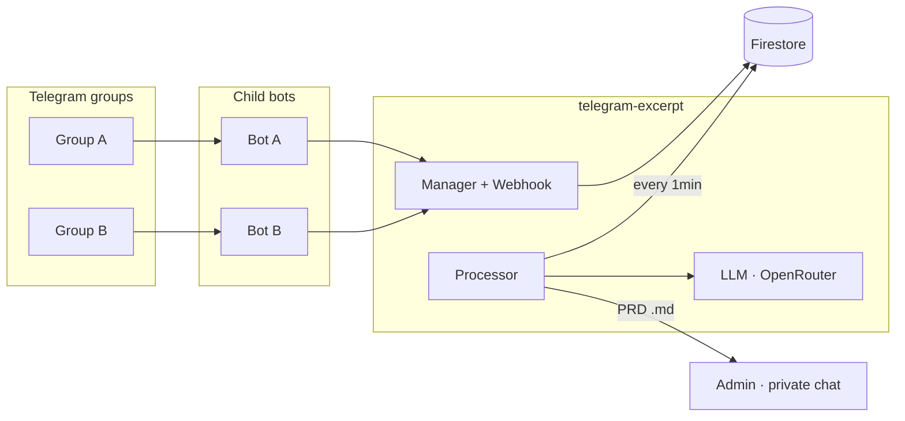

# telegram-excerpt

[](https://github.com/oreste/telegram-excerpt/actions/workflows/ci.yml)
[](https://www.python.org/downloads/)
[](LICENSE)
[](https://github.com/astral-sh/ruff)

> **Multi-bot Telegram → PRD generator.** Monitors multiple Telegram groups
> through dynamically configurable bots, buffers messages in Firestore, and
> after a period of silence uses an LLM (via OpenRouter) to turn informal
> conversations into structured PRDs, delivered to the admin as `.md` files.

## Why

If you manage several Telegram groups full of engineering chatter, requests
come in scattered: bugs, proposals, questions — all mixed with chitchat.
Reading every message to decide *what becomes a task* is cognitive noise.
This tool automates the triage:

1. One bot per group observes the conversation.
2. After **3 minutes of silence** (configurable) a flush runs.
3. An LLM decides whether the conversation produced actionable content.
4. If so, it generates one or more **PRDs** and sends them to you in
   private chat as `.md` files — one per distinct topic, with author,
   timestamp, and a reference to the source group.

The result: you open Telegram once a day, read the PRDs, and pick what
to bring into your sprint.

## Architecture (high level)



For architectural decisions and flow diagrams, see
[`docs/ARCHITECTURE.md`](docs/ARCHITECTURE.md).

## Quickstart — local (docker-compose)

Prerequisites: Docker, a GCP project with Firestore enabled, an
OpenRouter account, at least 2 Telegram bots created via @BotFather
(one **admin**, and one **child** bot per group to monitor).

```bash
# 1. Clone and prepare secrets
git clone https://github.com/oreste/telegram-excerpt.git
cd telegram-excerpt
cp .env.example .env
# Edit .env with your tokens
mkdir secrets
# Download the Firestore service-account JSON and save as:
#   secrets/firebase.json

# 2. Run
docker-compose up --build

# 3. Message your admin bot in private chat:
#    /help
#    /add_bot <CHILD_BOT_TOKEN> <GROUP_CHAT_ID> 20
```

Full details, troubleshooting, and how to discover a group's `chat_id`:
[`docs/LOCAL_DEV.md`](docs/LOCAL_DEV.md).

## Quickstart — production (Cloud Run)

The architecture is designed to stay within the **GCP free tier**
(Cloud Run scale-to-zero + Firestore Spark plan). Full instructions:
[`docs/DEPLOY_CLOUD_RUN.md`](docs/DEPLOY_CLOUD_RUN.md).

## Configuration — environment variables

| Variable                         | Required     | Default                          | Description                                                             |
| -------------------------------- | ------------ | -------------------------------- | ----------------------------------------------------------------------- |
| `TELEGRAM_ADMIN_BOT_TOKEN`       | ✓            | —                                | Admin bot token.                                                        |
| `FORWARD_CHAT_ID`                | ✓            | —                                | Admin's private chat ID (sole PRD recipient).                           |
| `OPENROUTER_API_KEY`             | ✓            | —                                | OpenRouter API key.                                                     |
| `OPENROUTER_MODEL`               |              | `qwen/qwen3.6-plus:free`         | LLM model id (OpenRouter or compatible API).                            |
| `OPENROUTER_BASE_URL`            |              | `https://openrouter.ai/api/v1`   | Base URL for the LLM API (change for Groq, etc).                        |
| `GOOGLE_APPLICATION_CREDENTIALS` | ✓            | —                                | Path to the service-account JSON.                                       |
| `FIRESTORE_PROJECT_ID`           | ✓            | —                                | GCP project ID.                                                         |
| `MODE`                           |              | `polling`                        | `polling` (dev) or `webhook` (Cloud Run).                               |
| `BASE_URL`                       | if `webhook` | —                                | Public HTTPS URL (e.g. `https://xxx.run.app`).                          |
| `BATCH_SILENCE_SECONDS`          |              | `180`                            | Seconds of silence before flush.                                        |
| `DEFAULT_N`                      |              | `50`                             | Default max messages per batch.                                         |
| `SCHEDULER_AUTH_TOKEN`           | if `webhook` | —                                | Bearer for `/tasks/process` and `/admin/setup`.                         |
| `CHAT_RESPONDER_ENABLED`         |              | `false`                          | If true, each child bot also replies to group messages via LLM.         |
| `CHAT_RESPONDER_SYSTEM_PROMPT`   |              | (Italian default)                | Custom system prompt for the responder (keep the `SKIP` instruction).   |
| `CHAT_RESPONDER_MODEL`           |              | falls back to `OPENROUTER_MODEL` | OpenRouter model used by the responder.                                 |
| `CHAT_RESPONDER_MAX_TOKENS`      |              | `400`                            | Max tokens per responder reply.                                         |
| `CHAT_RESPONDER_RATE_LIMIT`      |              | `5`                              | Max responder replies per user per rate window.                          |
| `CHAT_RESPONDER_RATE_WINDOW_SECONDS` |          | `60`                             | Rate-limit sliding window in seconds (per user).                        |
| `CHAT_RESPONDER_DAILY_BUDGET`    |              | `500`                            | Max responder LLM calls per day (0 = unlimited).                        |

## Admin commands

In private chat with the admin bot:

- `/add_bot <token> <chat_id> [N]` — register a child bot.
- `/remove_bot <chat_id>` — remove a child bot.
- `/list_bots` — list registered bots.
- `/set_n <chat_id> <N>` — update the batch-size.
- `/help` — show help.

## Dev commands

```bash
pip install -e ".[dev]"
ruff check src tests
ruff format src tests
mypy src
pytest                              # mock tests only (CI-safe)
pytest -m llm                       # run LLM classification tests against real API
pytest -m llm -k edge               # run only edge-case scenarios
```

### Classification prompt evaluation

The file `tests/test_classify_scenarios.py` contains 22 realistic
conversation scenarios (8 actionable, 7 non-actionable, 7 edge cases)
used to evaluate and tune the classification prompt in
`src/telegram_excerpt/llm.py`.

- **Mock tests** (`pytest`) run by default in CI — they verify the
  parsing pipeline, not the prompt quality.
- **LLM tests** (`pytest -m llm`) call the real LLM API and verify that
  the prompt classifies each scenario correctly. Requires a valid
  `OPENROUTER_API_KEY` and `OPENROUTER_MODEL` in `.env`.

To iterate on the prompt: edit `_CLASSIFY_SYSTEM_PROMPT` in `llm.py`,
then run `pytest -m llm -v` and check which scenarios pass or fail.

## Optional: chat responder

Setting `CHAT_RESPONDER_ENABLED=true` turns every child bot into a
conversational assistant: for each message in its group it calls the
LLM (same OpenRouter client) and posts a reply in the thread.

The default system prompt tells the model to answer `SKIP` when it has
nothing useful to add, so the bot stays silent unless it can
contribute. Customize via `CHAT_RESPONDER_SYSTEM_PROMPT`.

The responder runs in parallel to the PRD pipeline: messages are still
buffered and processed into PRDs, regardless of whether a reply was
sent.

> ⚠️ Busy groups will burn through LLM tokens fast. Pick a cheaper model
> via `CHAT_RESPONDER_MODEL` and review the prompt before enabling in a
> high-traffic channel.

## Security and privacy

- **Group messages are temporarily stored in Firestore** (deleted after
  every flush). Consider the privacy implications in your context.
- Every webhook endpoint validates `X-Telegram-Bot-Api-Secret-Token`.
- Internal endpoints (`/tasks/*`, `/admin/*`) require a bearer token.
- All tokens are `SecretStr` — they never appear in logs/repr.
- The LLM prompts in `src/telegram_excerpt/llm.py` are in Italian by
  default — fork the repo and localize them as needed.
- **Never commit** `.env` or the service-account JSON.

## License

MIT — see [LICENSE](LICENSE).
