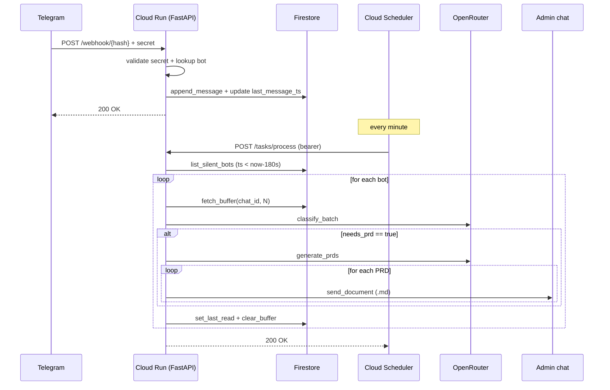

# Architecture

## Components

```
telegram-excerpt/
├── __main__.py       ← entrypoint, branches on MODE
├── config.py         ← Settings (pydantic-settings)
├── logging_conf.py   ← structlog
├── models.py         ← BotConfig, BufferedMessage, PRDDoc, ClassifyResult
├── exceptions.py     ← custom exceptions
├── storage.py        ← async Firestore client
├── manager.py        ← BotRegistry + PTB Applications lifecycle
├── admin.py          ← admin commands
├── processor.py      ← flush_if_silent (classify + generate + send)
├── llm.py            ← classify_batch, generate_prds (OpenRouter)
└── web.py            ← FastAPI app (MODE=webhook only)
```

## Firestore data model

### `bots/{chat_id}`

| Field                   | Type       | Description                                          |
| ----------------------- | ---------- | ---------------------------------------------------- |
| `token`                 | string     | Telegram bot token.                                  |
| `token_hash`            | string     | SHA-256[:16] of the token — used as webhook path.    |
| `chat_id`               | int        | Telegram group ID.                                   |
| `chat_title`            | string     | Group title (light cache).                           |
| `n`                     | int        | Max messages per batch.                              |
| `last_read_message_id`  | int        | Last already-processed `message_id`.                 |
| `last_message_ts`       | timestamp  | Timestamp of the last received message.              |
| `has_pending`           | bool       | "There are messages to process" flag.                |
| `webhook_secret`        | string     | Secret sent in the Telegram webhook header.          |
| `enabled`               | bool       | Bot active.                                          |
| `created_at`            | timestamp  | Registration date.                                   |

### `bots/{chat_id}/buffer/{message_id}`

Sub-collection with messages awaiting processing.

| Field         | Type        |
| ------------- | ----------- |
| `message_id`  | int         |
| `chat_id`     | int         |
| `user_id`     | int \| null |
| `user_name`   | string      |
| `text`        | string      |
| `ts`          | timestamp   |

## Flows

### 1. Webhook mode (production)



### 2. Polling mode (local dev)

Same flow, except:

* PTB Updaters do long-polling (no Telegram webhook needed).
* An internal asyncio loop calls `Processor.tick()` every
  `POLLING_SCHEDULER_INTERVAL_SECONDS` (default 30).

## Design choices

### Why webhook on Cloud Run?

To stay within the **Cloud Run free tier** (360K vCPU-sec/month) the
container must scale to zero. Long polling would require an always-on
container (~720h/month × 1 vCPU = well over the limit). Webhooks are
request-based: the container wakes only when an update arrives.

### Why Firestore?

* Generous free tier (50K reads / 20K writes / 20K deletes per day).
* Native async client for Python.
* Serverless: no DB instance to maintain.

Quota estimate with 5 bots × 50 msgs/day:

| Operation                             | Per day  | Free quota |
| ------------------------------------- | -------- | ---------- |
| Writes (append_message + flag)        | ~500     | 20K        |
| Reads (scheduler scan + fetch_buffer) | ~7.5K    | 50K        |
| Deletes (clear_buffer)                | ~250     | 20K        |

Comfortable margin.

### Why a `has_pending` flag instead of N+1 sub-queries?

`list_silent_bots` filters on
`enabled AND has_pending AND last_message_ts <= threshold` in one query,
avoiding a sub-query on every buffer just to check emptiness. The flag
is set in `append_message` (same batch commit) and reset in
`set_last_read`.

### Flush idempotency

Exact order of operations on successful flush:

1. `set_last_read(last_msg_id)` ← advances the cursor
2. `clear_buffer_up_to(last_msg_id)` ← deletes processed documents

If a crash happens **between** step 1 and 2, at the next tick:

* `fetch_buffer` filters `message_id > last_read_message_id` → skips
  already-sent messages.
* `clear_buffer_up_to` will still be called: eventual cleanup.

If a crash happens **before** the PRD send:

* `last_read_message_id` is not updated.
* At the next tick the messages are re-processed (at-least-once).

## Threat model (summary)

| Threat                                  | Mitigation                                             |
| --------------------------------------- | ------------------------------------------------------ |
| Webhook impersonation                   | `X-Telegram-Bot-Api-Secret-Token` per-bot.             |
| Direct calls to `/tasks/*`              | Bearer token (`SCHEDULER_AUTH_TOKEN`).                 |
| Admin command from unauthorized user    | Check `chat_id == FORWARD_CHAT_ID`, log + ignore.      |
| Token leak in logs                      | `SecretStr` + log only `token_hash[:8]`.               |
| Secrets in the repo                     | `.gitignore` + `gitleaks` pre-commit + dependabot.     |
| Bot added to unauthorized groups        | Handler ignores messages if `chat.id != registered`.   |
